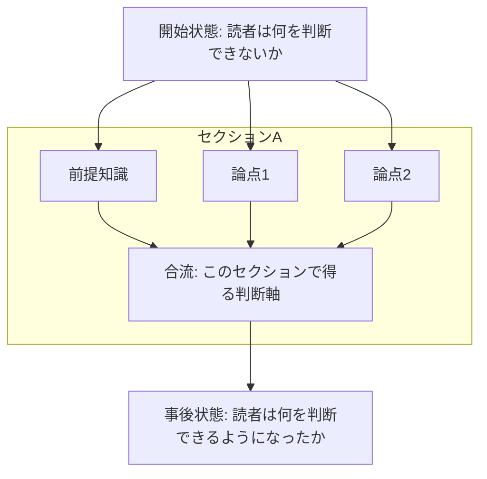
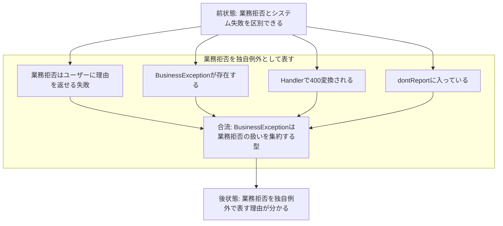
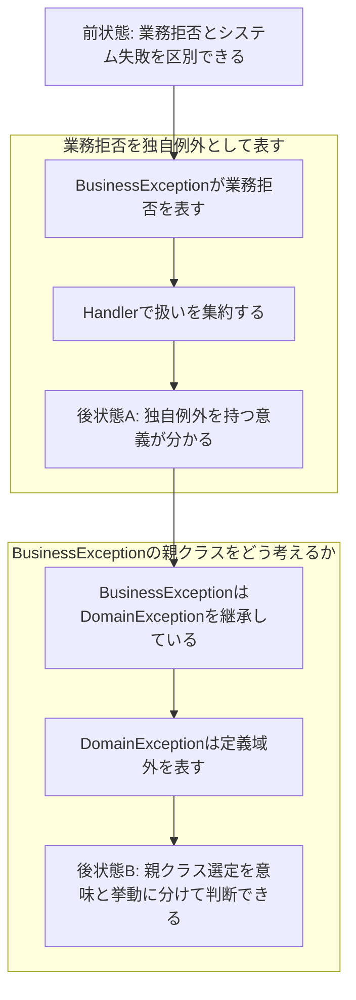

# Reader State Transition Flow

Reader State Transition Flow は、記事を文字列ではなく、読者状態を遷移させる設計図として扱うためのフローチャートである。本文を書く前、または大幅に直す前に、人間と構成をすり合わせるために使う。

## 目的

- 記事全体を、読者の事前状態から事後状態への遷移として理解する。
- 各セクションが渡す知識を明確にする。
- 論点の分岐・合流を見つける。
- セクション分割、順序入れ替え、削除候補を本文執筆前に判断する。
- 人間が本文を読まなくても、構成レビューできる状態を作る。

## 基本形



## 書き方

### 読者状態をノードにする

見出しをノードにしない。読者が何を判断できる状態かを書く。

Bad:

```text
BusinessExceptionの親クラス
```

Good:

```text
独自例外を持つ意義と、親クラス選定を別問題として判断できる
```

### セクション内の論点を並列ノードにする

セクションの中に複数の論点がある場合、直列にしすぎない。論点が同じ結論へ合流するなら、分岐してjoinする。



## 分岐を望ましいものとして扱う

記事の論点は直列だけで進まない。複数の前提、具体例、比較対象、反例が同じ結論へ合流することが多い。分岐は複雑さではなく、読者が理解するための依存関係を表す。

分岐させるべきもの:

- 用語の意味と実装上の挙動。
- 一般論と具体例。
- 業務分類とプログラム上の分類。
- 狭く扱う境界と広く扱う境界。
- 既存実装の評価とゼロから設計する場合の判断。

分岐させないほうがよいもの:

- 単なる時系列。
- 1つの概念を言い換えているだけの重複。
- 本文上は削るべき補足。

## セクション分割の検出

分岐したノード列が別々の読者状態へ向かう場合、同一セクションに押し込まない。



この例では、Aは「独自例外を持つ意義」、Bは「親クラス選定の評価」を扱う。読者状態が違うため、別セクションにする。

## 本文実装前のチェック

| 観点 | 確認 |
|---|---|
| 開始状態 | 読者が最初に何を判断できないか明確か |
| 最終状態 | 読後に何を判断できるか明確か |
| ノード密度 | 1〜2ノードを長く書こうとしていないか |
| 分岐 | 並列に理解すべき論点が分岐しているか |
| 合流 | 分岐した論点がどの判断へ合流するか明確か |
| セクション境界 | 別の読者状態へ向かうノード列を同一セクションに入れていないか |
| 削除候補 | どの状態遷移にも貢献しないノードを削れているか |

## Mermaid出力の最小ルール

- `flowchart TD` を使う。
- 読者状態は `S0`, `S1` のような状態ノードにする。
- セクションは `subgraph` で囲む。
- 論点は `A1`, `A2` のようにノード化する。
- 合流ノードを置く。
- 直列だけで済ませず、分岐を検討する。
